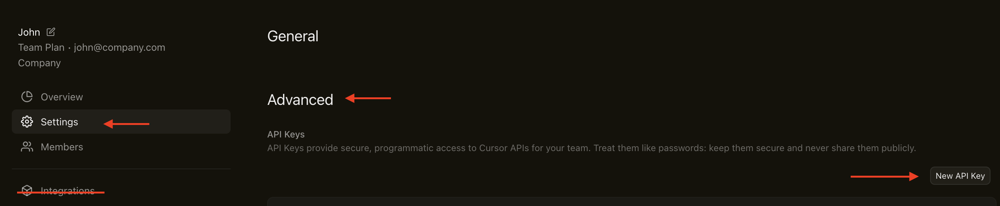
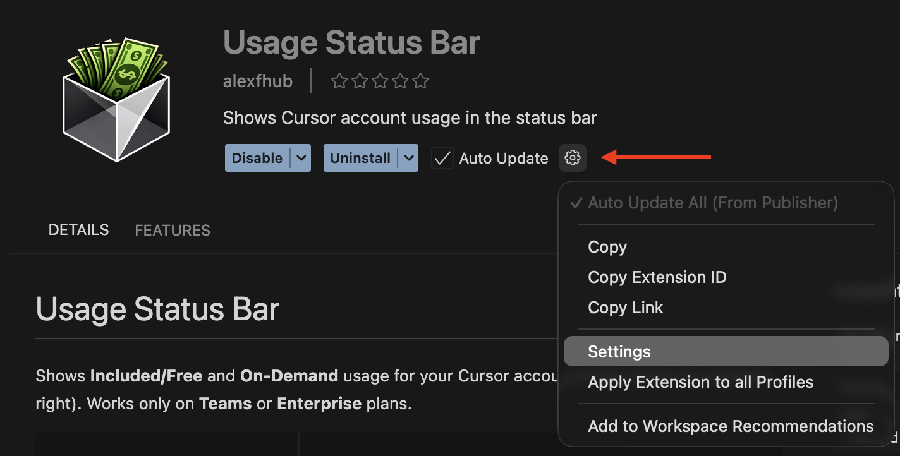
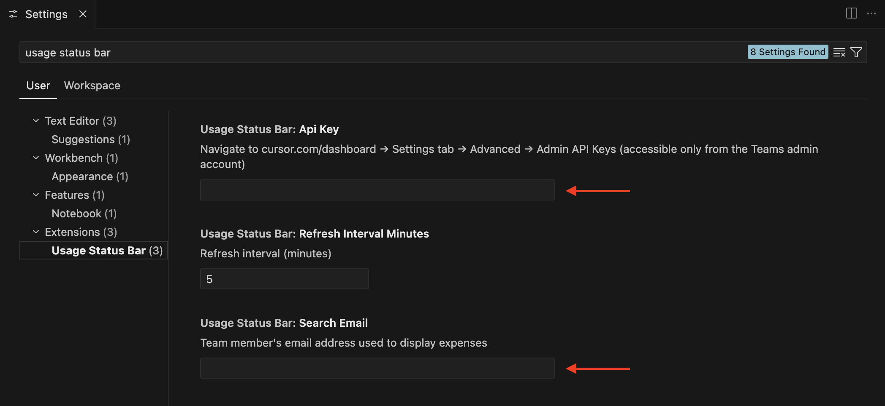

# Usage Status Bar

Shows **Included/Free** and **On-Demand** usage for your Cursor account in the status bar (bottom-right). Works only on **Teams** or **Enterprise** plans.


- Displays spending for the current billing cycle in the status bar
- Hover to see the start date of the billing period
- Auto-refreshes on an interval; you can also run **Usage Status Bar: Refresh** from the Command Palette

## Requirements

- **Cursor** 2.4.22+
- **Teams** or **Enterprise** plan (Admin API is only available for these)
- A team admin API key from the Cursor dashboard

**Be careful:** sharing the API token of your admin account with other team members can be insecure. However, at the moment, this is the only way to access Cursor usage statistics.

## Where to create the token

Go to **cursor.com/dashboard → Settings tab → Advanced → Admin API Keys** and click **New API key**.


**Important:** tokens created in the **Integrations** section will **NOT** work.

## Configuration

### Method 1 — Quick

1. After installing the extension, click the gear icon and select **Settings** from the menu.

2. You should see a **usage status bar** section with the fields **Api Key**, **Search Email**, and **Refresh Interval Minutes**.
3. Add the token and the email address associated with your Cursor account.

4. **Restart Cursor**

### Method 2 — Via the Cursor settings

1. Press **Cmd + Shift + P**.
2. Type **Open Settings** or **Preferences: Open Settings (UI)**.
3. Select **Preferences: Open Settings (UI)** (or **Open Settings**).
4. The Settings window will open with a search field at the top. Type **usage status bar** into the search.
5. You should see a **usage status bar** section with the fields **Api Key**, **Search Email**, and **Refresh Interval Minutes**.
6. **Restart Cursor**

If **Cmd + ,** in Cursor opens **“Cursor Settings”** (account/plan), note that extension settings are **not** located there. You need to access them via **Command Palette → “Open Settings (UI)”**, not through Cursor Settings.

### Method 3 — Edit JSON directly

1. **Cmd + Shift + P → Preferences: Open User Settings (JSON)**
2. Add the parameters **`usageStatusBar.apiKey`** and **`usageStatusBar.searchEmail`** directly to the **User Settings JSON** like this:
```json
{
  "usageStatusBar.apiKey": "YOUR_API_KEY_HERE",
  "usageStatusBar.searchEmail": "your-email@example.com"
}
```
3. **Restart Cursor**

## Support me

If you like the extension, feel free to buy me a coffee via the link https://ko-fi.com/alexxxf